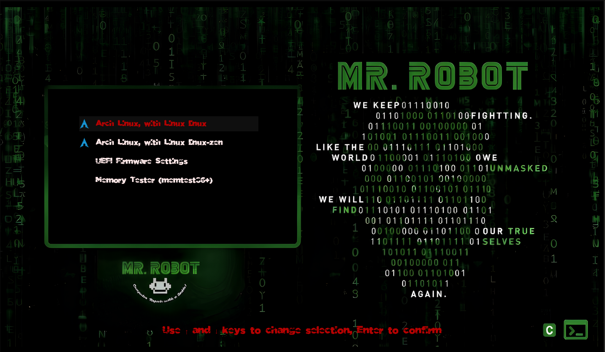

# Mr Robot GRUB theme 🤖🔥

Supported languages: Chinese (simplified), English, French, German, Italian, Norwegian, Portuguese, Russian, Spanish, Turkish, Ukrainian

## 


## Installation


- Open terminal.

- Clone this repository

  ```
  git clone https://github.com/Qaddoumi/mr-robot-grub-theme.git
  ```

- Change directory to the Mr Robot Theme

  ```
  cd mr-robot-theme
  ```

- Review install script at ./install.sh

- Run the install script

  ```
  ./install.sh
  ```

- Reboot your PC

